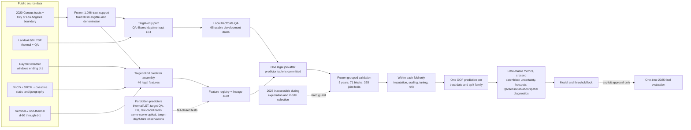

# Data flow and leakage barriers

The Landsat target path and predictor path remain separate until the predictor
table, registry, temporal cutoffs, and provenance are frozen. Geometry is used
to define tracts, fixed spatial blocks, and diagnostic maps; it is not a primary
model predictor. The primary analysis is a historical one-day-ahead hindcast,
not an operational forecast, because lagged predictors are historical observed
data. LST is a clear-sky surface-heat hazard proxy, not air temperature or a
human health outcome.

