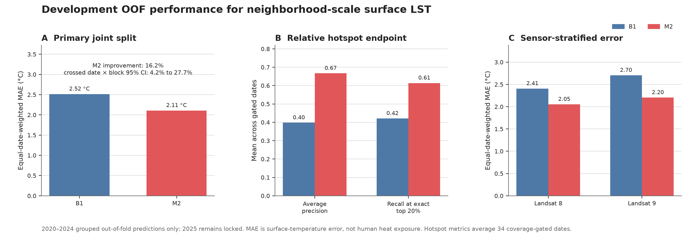
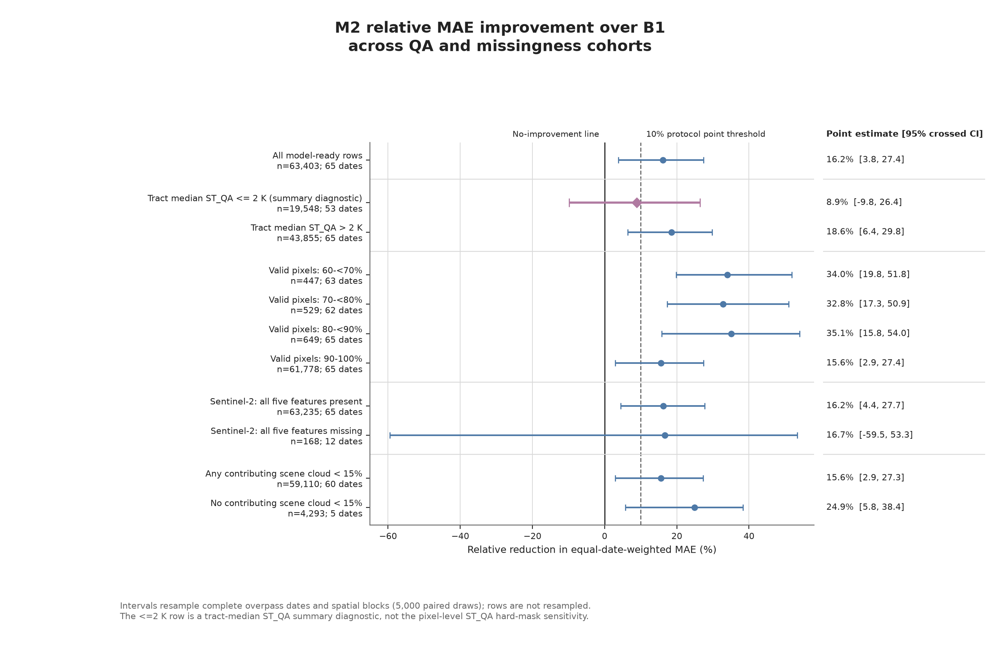
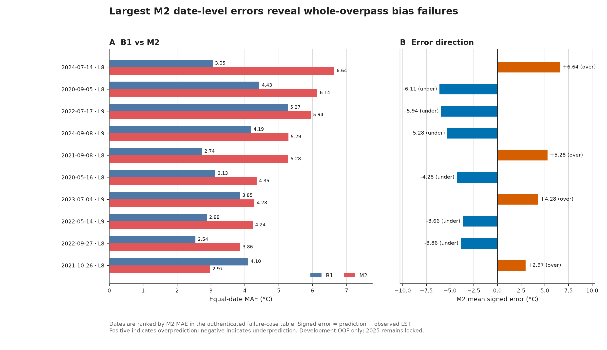
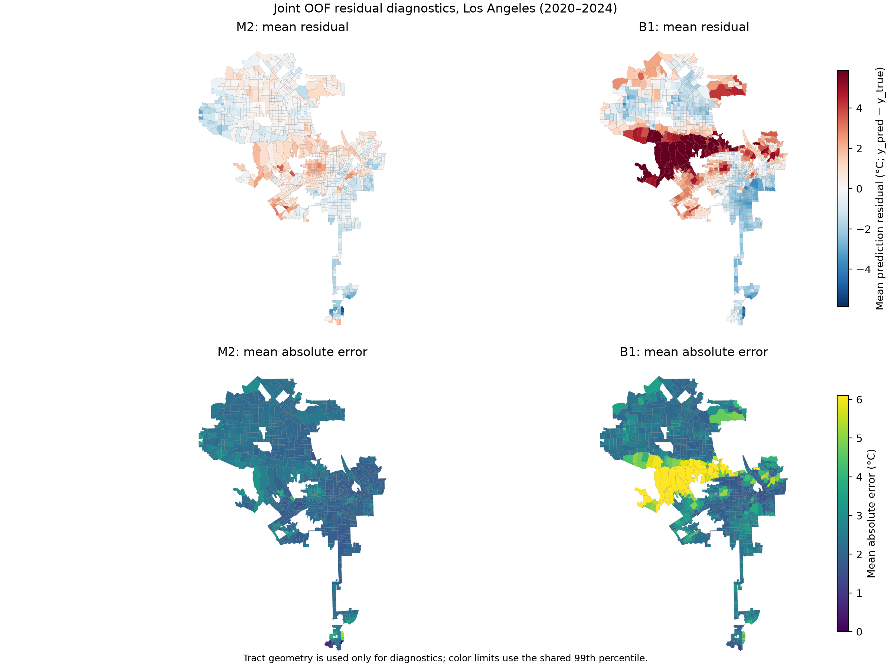
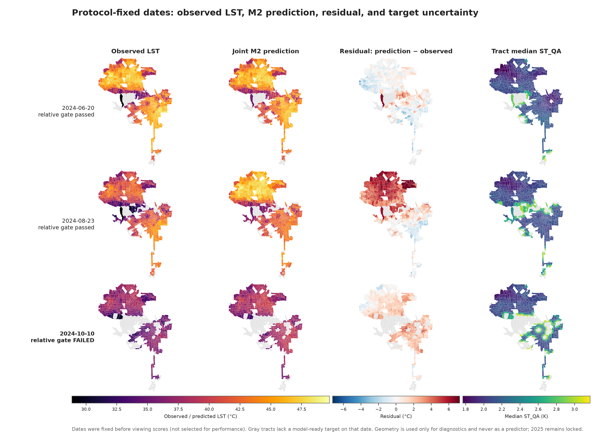

# Predicting neighborhood-scale surface heat in Los Angeles

## Development-only result report

**Research question.** Can public weather, land-use/geography, and lagged
satellite-derived features predict neighborhood-level urban surface-heat risk?

This report covers only the locked 2020–2024 development evaluation. Calendar
year 2025 remains untouched and locked. The response is QA-filtered daytime
Landsat land-surface temperature (LST), a clear-sky surface-heat hazard proxy;
it is not air temperature, personal heat exposure, illness, or mortality.

## Main result

Across 63,403 legal tract-date observations, 65
independent overpass dates, and 71 spatial blocks, the strongest
legal baseline (B1) had date-macro MAE
2.516 °C. The full nonlinear model
(M2) had MAE 2.109 °C,
an improvement of 0.407 °C or
16.2%. The predeclared 5,000-draw
crossed date-by-block bootstrap interval was
4.2% to
27.7%;
`P(improvement > 0)=0.995`.
Median per-date Spearman correlation was
0.793. The required development gates
passed, while the stronger claim that the entire interval exceeds 10% did not.

## Design and leakage controls

- Prediction origin was 00:00 local time on the target date; dynamic observed
  predictors ended at day −1. This is a historical hindcast, not an operational
  weather forecast.
- Predictors comprised public land-use/geography, calendar, lagged Daymet weather,
  and Sentinel-2 composites. Landsat thermal data, target-derived fields,
  same-scene optical data, future data, and tract identifiers were prohibited.
- Validation held out whole years, fixed spatial blocks, and joint year × block
  combinations. Preprocessing and tuning were fitted inside the training fold.
- Confidence intervals resampled complete dates and complete spatial blocks, never
  individual tract-date rows.

## Relative hotspot endpoint

The exact top-20% hotspot endpoint was evaluated only on the
34 dates that passed the frozen spatial coverage gate.
Mean per-date average precision increased from
0.398 to
0.667; exact top-20%
recall increased from
0.421 to
0.614.

## Feature-set diagnostics

Each reduced feature set was refitted under the frozen grouped splits. Positive
values mean the full model performed better. These comparisons show predictive
association and do not identify causal effects or single-feature importance.

| Reduced refit | Reduced MAE (°C) | All-feature MAE (°C) | Full-model improvement (95% CI) |
|---|---:|---:|---:|
| calendar + weather | 2.565 | 2.109 | 17.8% (9.6% to 25.8%) |
| calendar + land_use + geography | 3.352 | 2.109 | 37.1% (25.3% to 46.9%) |
| calendar + lagged satellite | 3.614 | 2.109 | 41.7% (32.0% to 50.2%) |

## QA sensitivity and failure cases

The prespecified pixel-level `ST_QA ≤ 2 K` rebuild completed all 90 dates, but
only 15 passed the unchanged usable-date rule,
below the required 30. Therefore the
strict target was not promoted. On the 15 retained dates, frozen primary OOF predictions showed a 17.8% M2 improvement, but the crossed-cluster 95% interval (-5.2% to 39.6%) crossed zero. The earlier tract-median
`ST_QA ≤ 2 K` cohort remains a separate summary diagnostic and is not a substitute
for this pixel-level rebuild.

The all-five-Sentinel-missing group contains only 168 rows, 12 dates, and 29
blocks; its interval is too wide for a general conclusion. Several entire dates
also show large signed errors, demonstrating vulnerability to unusual overpass
conditions.

## Spatial diagnostics

Mean date-level Moran's I decreased from
0.639 for
B1 to
0.574 for
M2, but remained positive on all 65 dates.
The model reduces but does not remove strong spatial residual clustering. The
permutation p-values are exploratory and unadjusted.

## Fixed-date maps

These dates were fixed by the protocol rather than chosen after viewing model
performance. The October date failed the relative-endpoint coverage gate but
remains useful as a failure-case map.

## Conclusion

The locked development evidence supports the limited statement that public
weather, land-use/geography, and lagged optical-satellite features predict
clear-sky neighborhood-scale Landsat LST better than the strongest legal baseline
under joint spatiotemporal validation. It does not establish causation, human heat
exposure, health effects, or final-year generalization. The strict 2 K sensitivity
lost too many independent dates and its interval crossed zero, while residuals
remained spatially clustered; both materially limit the strength of the claim.

## Reproducibility and sources

Every value above is generated from authenticated tables under
`reports/tables/`; no report value was hand-edited. The source-to-claim literature
map is in [`docs/LITERATURE_EVIDENCE.md`](../docs/LITERATURE_EVIDENCE.md), including
USGS Landsat Collection 2 documentation, Sentinel-2 L2A documentation, Daymet V4
R1, structured cross-validation, Moran's I, and the LST-versus-exposure boundary.

**Current boundary:** `final_test_year=2025`, `final_test_locked=true`,
`final_test_used=false`.
